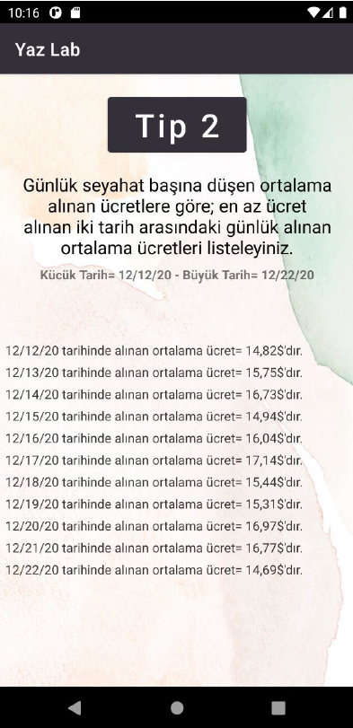

# Taxi-Tracking-App

#### This repository includes making simple query in cloud server(firebase) for mobile phones

## Abstract

Within the scope of this project, you are expected to develop an application on the android platform using cloud computing and google map api.
We aim to develop an application where different queries can be made on the android platform using the data of taxi Gezinge (trajectory).

## Queries
* List the 5 days with the most passengers and the total number of passengers. (En fazla yolcu taşınan 5 günü ve toplam yolcu sayılarını listeleyiniz.)
* What is the number of vehicles departing from a specific location between two dates? (dates and location must be selected) -İki tarih arasInda belirli bir lokasyondan hareket eden araç sayısı kaçtır? (tarihler ve lokasyon seçilebilmeli) -
* Draw the route of the longest trip on a given day (Belirli bir günde en uzun seyahatin harita üstünde yolunu çiziniz )

## Data
Files Address : https://www1.nyc.gov/site/tlc/about/tlc-trip-record-data.page 
File name 1   : yellow tripdata 2020-12.csv 
File name 2   : taxi+ zone lookup.csv

## İnterface

 
 

## Developers
[Mahmut ÖZ](https://github.com/mahmutoz/) / [Ömer Gürbüz](https://github.com/ZeyMer1309)
